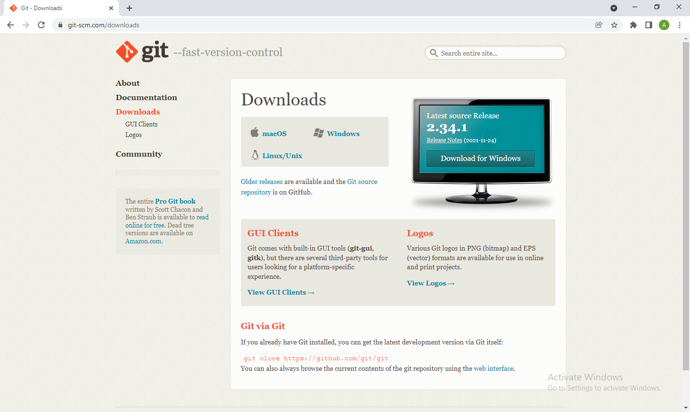
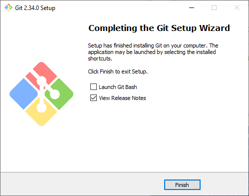
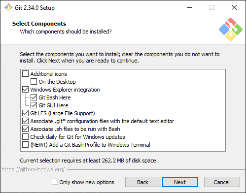
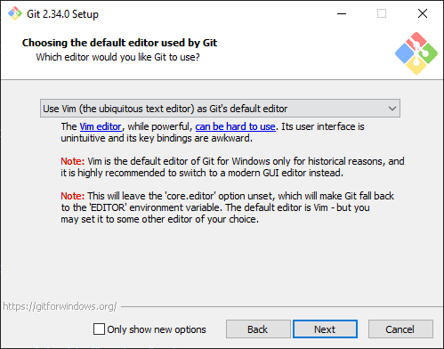
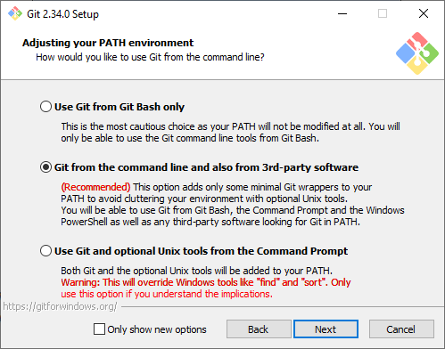
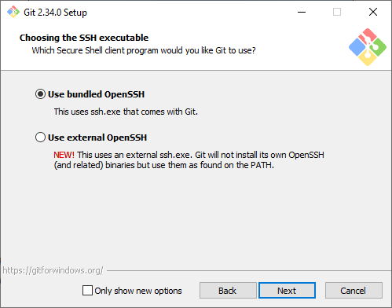
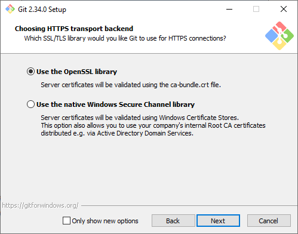
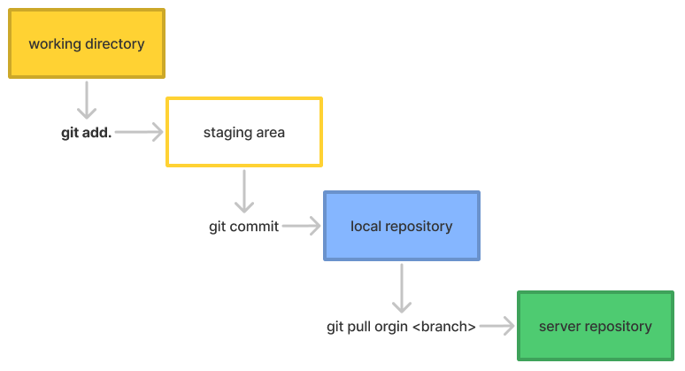
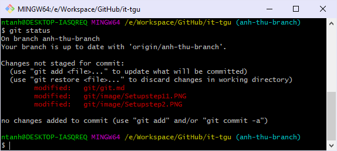

# Git
## Giới thiệu về Git
Git là tên gọi của một Hệ thống quản lý phiên bản phân tán (Distributed Version Control System - DVCS) là một trong những hệ thống quản lý phiên bản phân tán phổ biến nhất hiện nay. DVCS nghĩa là hệ thống giúp mỗi máy tính có thể lưu trữ nhiều phiên bản khác nhau của một mã nguồn được nhân bản (clone) từ một kho chứa mã nguồn (repository), mỗi thay đổi vào mã nguồn trên máy tsnh có thể ủy thác (commit) rồi đưa lên máy chủ nơi đặt kho chứa chính. Và một máy tính khác(nếu họ có quyền truy cập) cũng có thể clone lại mã nguồn từ kho chứa hoặc clone lại tập hợp các thay đổi mới nhất trên máy tính kia. Trong Git. Thư mục làm việc trên máy tính gọi là Working Tree.  
## Cách cài đặt Git về máy
- ### Bước 1: Tải tập tin cài đặt Git
Tải Git qua đường dẫn bên dưới hoặc Gõ Git DownLoad trên thanh tìm kiếm của Google
<https://git-scm.com/downloads>



Lựa chọn phiên bản phù hợp với hệ điều hành của bạn. Sau đó hệ thống sẽ tự động tải tập tin cài đặt phù hợp với bản hệ điều hành của bạn.

- ### Bước 2: Cài đặt
Open tệp vừa tải về. Nếu như máy của bạn có sử dụng tường lửa hoặc phân quyền để chặn các truy cập không khả tín thì bạn sẽ gặp thông báo Cảnh báo bảo mật, mình cứ chọn **Run** cho nó thực hiện cài đặt. Dưới đây là cửa sổ __Điều khoản__ , chọn **Next** để tiếp tục.




Các lựa chọn đã được chọn sẵn (tick): Bao gồm các trình cơ bản của Git là dòng lệnh, giao diện đồ họa, các gói hỗ trợ, khai báo loại tập tin,... là những mục cần thiết để cài đặt.  
**Additional icon**, bao gồm **On the Desktop**: là cài biểu tượng lên màn hình làm việc để bạn mở giao diện đồ họa và cửa sổ dòng lệnh của Git nhanh hơn.  
**Check daily for Git for Windows updates**: là kiểm tra phiên bản hằng ngày xem có Git mới không để cập nhật luôn, cập nhật thường xuyên cũng là một trong những việc tăng cường bảo mật, khắc phục các lỗi của bản cũ.  
**Add a Git Bash Profile to Windows Terminal** thêm __Git Bash__ vào __Windows Terminal__  
Bấm **Next** để tiếp tục cài đặt.



Trình cài đặt yêu cầu lựa chọn một chương trình soạn thảo để chúng ta có thể biên tập lệnh cho Git bash. Mặc đinh là dùng Vim. Nhấn **Next** để đưa đến cửa sổ tạo nhánh (branch) trong repositories mới. Chọn **Let Git decide** để Git tự tạo nhánh mặc định branch name là __master__ . 



Cửa sổ tiếp theo dùng để cài đặt một trường PATH cho Git. Sử dụng lựa chọn mặc định được khuyên dùng của Git và đến cửa sổ tiếp theo.




SSH, hoặc được gọi là Secure Shell, là một giao thức điều khiển từ xa cho phép người dùng kiểm soát và chỉnh sửa server từ xa qua Internet.Trình cài đặt giúp bạn cài đặt thêm SSH và hỏi bạn có muốn cài đặt hay không!



Nên chọn phương tiện truyền tải HTTPS mặc định được trình cài đặt chọn sẽ sử dụng tệp ca-bundle.crt để xác nhận chứng chỉ máy chủ.



Các cửa sổ tiếp theo, bạn có thể dựa vào lựa chọn mặc định của trình cài đặt để tiến hành : 
**Configuring the line ending conversions** : Định cấu hình chuyển đổi kết thúc dòng 
**Configuring the terminal emulator to use with Git Bash** : Định cấu hình trình giả lập đầu cuối để sử dụng với Git Bash 
**Choose the default behavior of git pull** : Chọn hoạt động mặc định của git pull 
**Choose a credential helper** : chọn người trợ giúp xác thực thông tin.
**Configuring extra options** : Định cấu hình bổ sung. 
**Configruring experimental options** : Định cấu hình các tùy chọn thử nghiệm (bạn có thể bỏ qua không chọn thử nghệm).  


Sẽ mất vài giây để trình cài đặt hoàn tất.  


Launch Git Bash để mở giao diện Git Bash và View Release Notes mở trang web ghi chú bản Git phát hành sau khi nhấn nút **Finish**

- ### Bước 3: Kiểm tra cấu hình

Mở Git Bash và gõ `git version` hiện và ra kết quả như hình bên dưới  


Trong đó: 
- AORUS là tên người dùng (tài khoản máy tính Window) 
- DESKTOP-BMAFQ1N là tên máy tính Windows 
- MINGW64 là têm thư mục chứa chương trình Git Bash 
- git version 2.34.0.windows.1 là kết quả trả về tên phiên bản Git đã được cài đặt trên máy. 

Cài đặt tên người sử dụng, gõ lệnh: 
```
git config --global user.name "UserName"
```
Cài đặt email người sử dụng, gõ lệnh : 
```
git config --global email.name "username@gmail.com"
```
:+1: Như vậy là bạn đã cài đặt thành công git trên Window!

## Cách sử dụng Git
#### 1. Kiểm tra version   
```
$ git version
```
Câu lệnh dùng để kiểm tra version Git được cài đặt trên máy.  
#### 2. Đăng nhập tài khoản github   
```
$ git config --global user.name "User Name"
$ git config --global user.email "username@gmail.com"
```
:x: --global được sử dụng để áp dụng cho tất cả các project. Nếu bạn không sử dụng --global thì settings sẽ chỉ dùng cho riêng cho địa chỉ project đó.  
#### 3. Khởi tạo một local repository mới   
```
$ git init
```
Một thư mục con (ẩn) tên .git được tạo ra sau khi chạy lệnh, thư mục này chứa tất cả thông tin mô tả cho kho chứa dự án (Repository) mới – những thông tin này gọi là metadata gồm các thư mục như objects, refs … Sau lệnh này bạn có một Repo ở local và bắt đầu thực thi được các lệnh khác của Git.  


#### 4. Sao chép một Repository từ server về local  
```
$ git clone https://github.com/UserName/Repository.git
```
Có thể bạn đã tạo một repository trên server và bạn muốn sử dụng trên địa chỉ thư mục trên window. Câu lệnh trên sẽ tạo một thư mục mới có tên giống trên của repository đã tạo trên server về địa chỉ thư mục.  
#### 5. Nhánh trong Git  
Khi sử dụng Git, bạn có thể tạo ra nhiều  nhánh (branch) khác nhau. Câu lệnh Git này dùng để kiểm tra branch hiện tại đang được dùng trong repositoty:
```
$ git branch
```
Để tạo mới một branch:
```
$ git branch <name_branch>
```
Để tạo mới và sử dụng nhánh mới:
```
$ git branch -b <name_branch>
```
#### 6. Kiểm tra nhánh  
Trước khi muốn thay đổi source code, điều đầu tiên mà bạn cần phải làm là checkout một nhánh có tồn tại hay không và chuyển thay đổi nhánh sử dụng. Để checkout một nhánh, bạn dùng câu lệnh:
```
$ git checkout <name_branch>
```


#### 7. Cập nhật thay đổi của repository   
Quá trình cập nhật thay đổi của một repository phải qua nhiều khu vực để quản lý, kiểm tra và cập nhật lại trước khi thay đổi sever repository:



Các thay đổi của một repository sẽ được đi qua khu vực trung gian là Staging Area trước khi được đưa lên Server. Sau khi bạn thay đổi source code: Thêm mới, sửa, xóa files,... và sử dụng câu lệnh bên dưới để cập nhật  tất cả các thay đổi vào Staging Area
```
$ git add.
```
#### 8. Xem những thay đổi đã được cập nhật ở khu vực Staging Area:  
```
$ git status
```



Câu lệnh này cho phép bạn xem tình trạng hiện tại của mã nguồn như có bao nhiêu file được thêm mới hoặc chỉnh sửa. Những file nào đang nằm trong vùng Staging Area hoặc đang nằm ngoài Staging Area. Sau khi được hiện câu lệnh cho ra như hình trên, với 3 sự thay đổi của repository ở địa chỉ thư mục và chưa được add vào khu vực Staging Area.  
#### 9. Cập nhật thay đổi vào Local Repository  
Sau lệnh add, bạn cần sử dụng câu lệng Commit để đẩy thông tin thay đổi lên Local Respository: 
```
$ git commit -m "Message"
```
Xem lại lịch sử Commit   
```
$ git log 
```
Lệnh git log sẽ cho bạn biết về người commit, ngày giờ, mesage của những lần commit. 
Hoặc có thể sử dụng lệnh bên dưới để bỏ qua bước add vào Staging Area và commit thẳng vào Local Repository:
```
$ git commit -a
```
#### 10. Cập nhật lên Server Repository   
Sau câu lệnh Commit, thông tin mới chỉ được cập nhật lên Local Repository. Nếu muốn cập nhật lên server thì bạn phải sử dụng câu lệnh push:
```
$ git push origin <name_branch>
```
Ngoài ra, nếu chưa tồn tại remote trên server thì bạn cần phải add mới một remote trước rồi mới push:
```
$ git remote add origin <remote_url
$ git push origin <name_branch>
```
Xem thay đổi trước khi push   
```
$ git diff 
```
Lệnh này giúp bạn biết những gì đã được thay đổi giữa nhánh hiện tại và nhánh trước đó.  
#### 11. Gộp nhánh   
Sau một thời gian cập nhật các file và push lên Git trên branch mới, bây giờ mình cần phép(merge) code lại vào nhánh gốc (master), cũng như cập nhật thay đổi vào file gốc của server repository. Trước tiên, cần phải checkout ra khỏi branch hiện tại cần gộp để vào branch master, sau đó thì dùng lệnh merge để ghép branch mới vào master:
```
$ git checkout master 
$ git merge <new_branch
```
#### 12. Gộp commit   
```
$ git rebase -i HEAD~ 
```
Sau dấu ~ là số commit bạn muốn gộp. Sau khi gõ lệnh này một cửa sổ trình soạn thảo hiện ra. Thay đổi ký tự pick của các dòng sau dòng đầu thành s rồi lưu lại/kết thúc. Khi đó, trình soạn thảo để chỉnh sửa giải thích commit thiết lập cho commit sau khi đã tổng hợp sẽ được hiển thị, nên hãy chỉnh sửa lưu lại/kết thúc.  
#### 13. Pull từ remote repositoty   
```
$ git pull origin master 
```
Lệnh trên sẽ gộp những thay đổi mới kéo về từ Server Repository với nhánh hiện tại trên Local Repository. 